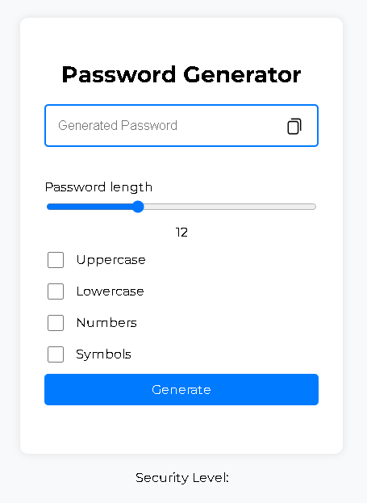
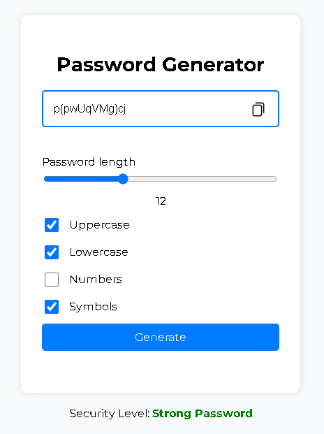

# Password Generator

## About
This repository contains a simple password generator developed using HTML, CSS, and JavaScript.

## Objective
The objective of this project is to create a functional and easy-to-use password generator using only fundamental web technologies: HTML for structure, CSS for styling, and JavaScript for generating passwords.

## Features
- Generate random passwords with customizable length.
- Option to include uppercase letters, lowercase letters, numbers, and special characters in the generated passwords.
- Easy-to-use interface with clear instructions.

## Technologies Used
- HTML
- CSS
- JavaScript

## Preview

